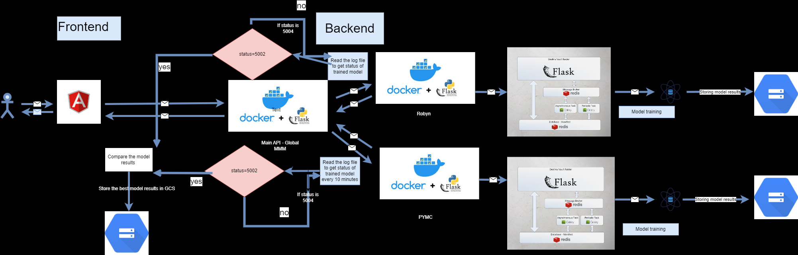

# Global MMM Application

## Architecture Overview

The Global MMM application is divided into two main components: frontend and backend.

### Frontend
The frontend is responsible for the user interface of the application.

### Backend
The backend is composed of three Docker images:

1. **Main API**:
   - Handles user requests from the frontend.
   - Invokes Robyn and PyMC APIs for model training with the desired inputs.
   - Periodically checks the status of the trained models.

2. **Robyn API**:
   - Facilitates Robyn model training.
   - Stores training results in Google Cloud Storage (GCS).

3. **PyMC API**:
   - Facilitates PyMC model training.
   - Stores training results in GCS.

## Model Training Process

- **Task Management**:
  - Model training is not performed directly by Python functions.
  - Flask API creates a Celery worker to manage the training task.
  - The Celery worker runs the Python function to train the model with specified parameters.

- **Status Monitoring**:
  - The Main API checks the status of the trained models from Robyn and PyMC every 10 minutes.
  - If both models return a status of `5002`, they are compared.
  - The better-performing model is stored in GCS and the results are displayed to the user.
  - If any model returns a status of `5004`, it indicates that model training is in progress. The application will wait until training is complete.

## Conclusion

The architecture of the Global MMM application ensures efficient model training and comparison using Dockerized services, Celery for task management, and GCS for result storage. This structure allows for scalability and reliability in handling complex model training processes.
